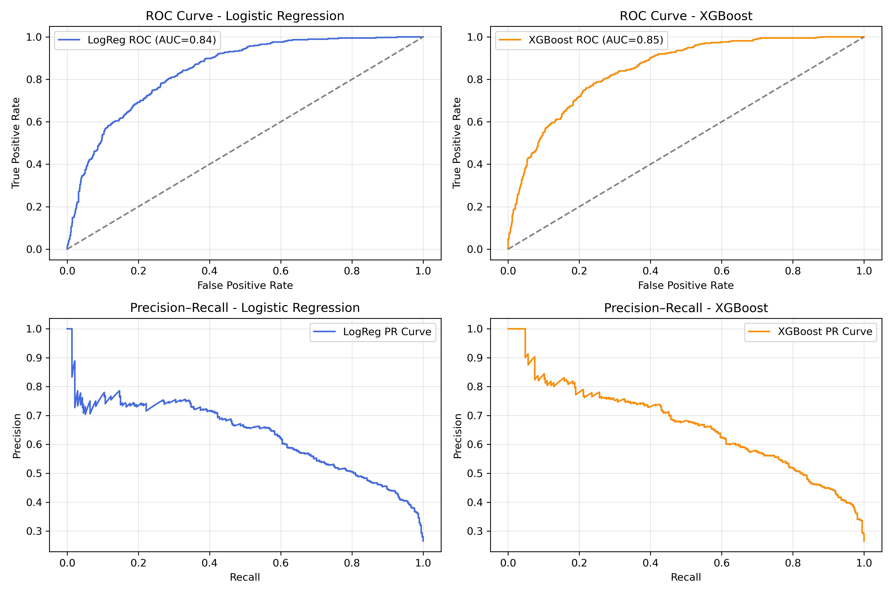
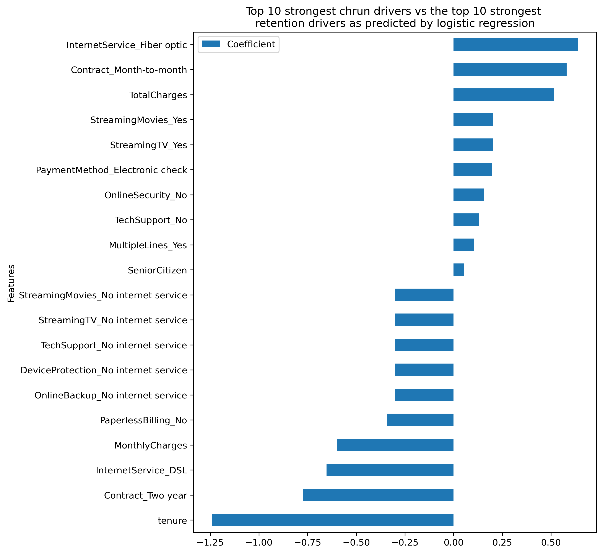
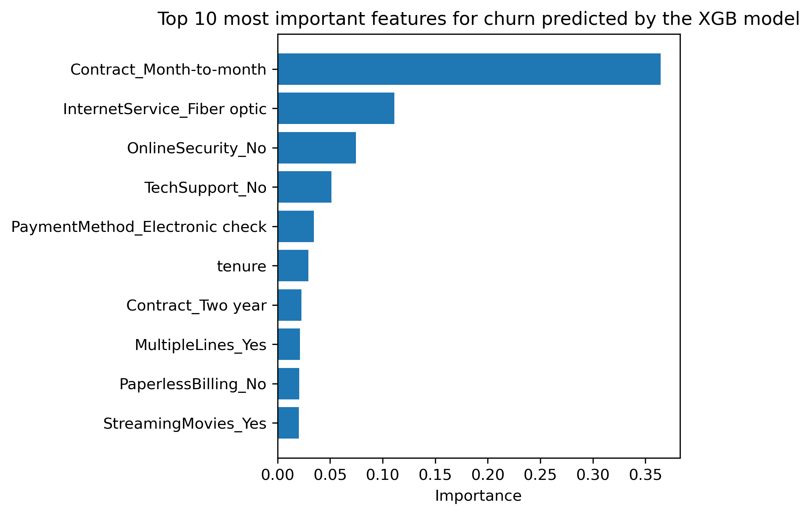

# 📊 Telco Customer Churn Prediction

**Goal:** Predict which telecom customers are most likely to leave using demographic and contract-related data.

## 🧠 Overview

This project explores the IBM Telco Customer Churn dataset.
I built two models — Logistic Regression and XGBoost — to predict customer churn and identify the main drivers behind it.

## ⚙️ Workflow

1. **Data cleaning:** handled missing TotalCharges, encoded categorical features.

2. **Modeling:** baseline Logistic Regression + tuned XGBoost with threshold optimization.

3. **Evaluation:** compared accuracy, ROC-AUC, precision, recall across thresholds.

4. **Interpretation:** visualized feature importances and extracted actionable business insights.

## 📈 Key Results

| Model               | ROC-AUC | Best Threshold | Recall | Precision |
| ------------------- | ------- | -------------- | ------ | --------- |
| Logistic Regression | 0.84    | 0.3            | 0.75   | 0.52      |
| XGBoost (tuned)     | 0.85    | 0.3            | 0.79   | 0.54      |

## 🚀 Model Performance

Below are the ROC and Precision–Recall curves for both models, illustrating their classification performance.

## 🔑 Feature importance plots

<table>
<tr>
<td>

   **Logistic Regression Feature Importance**

</td>
<td>

   **XGBoost Feature Importance**

</td>
</tr>
</table>

## 🗣️ Insights

- Month-to-month contracts and higher bills strongly correlate with churn.

- Long-term customers and DSL users show much higher retention.

- Optimizing retention should focus on promoting longer contracts and lower-cost plans.

## 💻 Tech Stack

- Python (pandas, scikit-learn, matplotlib, seaborn, xgboost, shap)

- Jupyter Notebook

## 📥 Data Source
The dataset used in this project is publicly available from IBM on [Kaggle: Telco Customer Churn Dataset](https://www.kaggle.com/datasets/blastchar/telco-customer-churn).

To reproduce the analysis:

1. Download the dataset file named

<pre>WA_Fn-UseC_-Telco-Customer-Churn.csv</pre>

2. Place it in this directory:

<pre>data/raw/WA_Fn-UseC_-Telco-Customer-Churn.csv</pre>

## 🧩 How to Run

<pre>bash pip install -r requirements.txt 
jupyter notebook notebooks/01_churn_analysis.ipynb</pre>